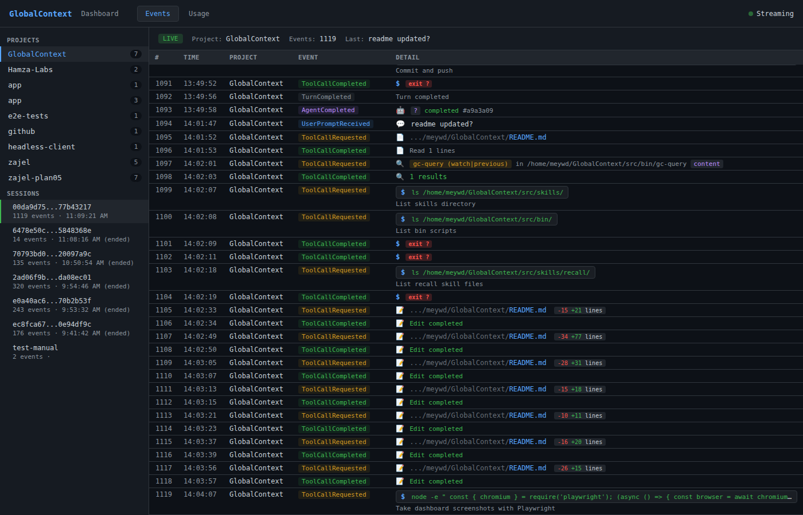
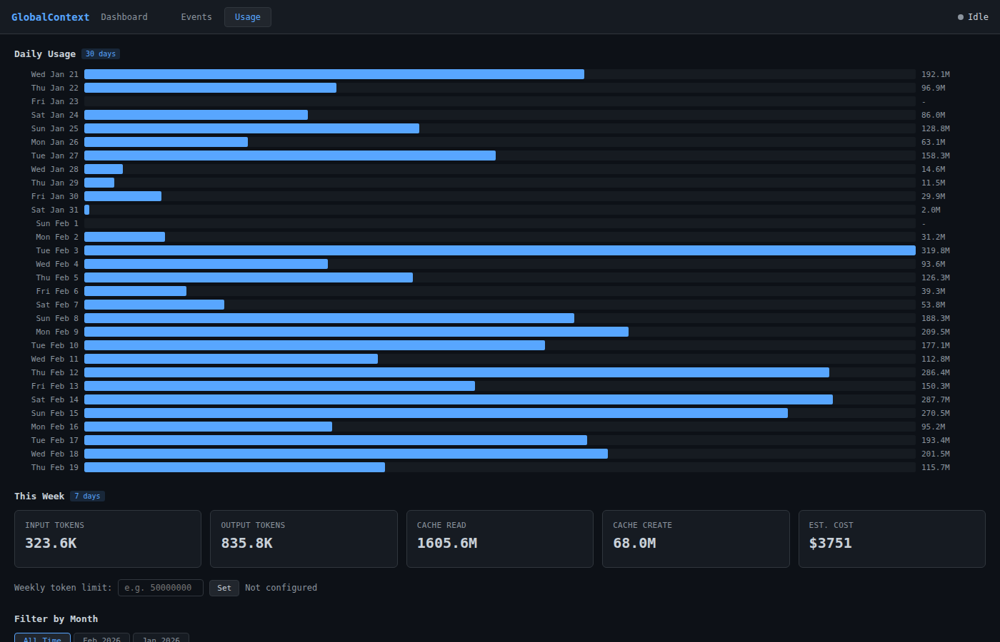

# GlobalContext

Event-sourced context store for Claude Code sessions. Captures every hook event as immutable JSON and provides projection-based queries for context recovery, a live dashboard with token usage analytics, and a `/recall` skill for cross-session memory.

## Features

- Append-only event store — nothing is ever lost, even after compaction
- CQRS architecture — fast write side (Bash+jq), smart read side (Node.js)
- Per-project isolation with automatic project-id derivation
- Per-session event streams with monotonic sequence numbers
- Five projection types for flexible context retrieval
- Automatic context injection after compaction/clear
- Progressive summarization for large sessions
- **Web dashboard** with live event feed, rich event formatting, and SSE streaming
- **Token usage analytics** — per-project, per-model, daily timeline, monthly views
- **OAuth utilization** — real-time 5-hour and 7-day usage percentage from Anthropic API
- **`/recall` skill** — cross-session memory retrieval directly from Claude Code
- **Live event monitor** — `gc-query watch` streams events in real time
- System prompt filtering — separates system-injected messages from real user prompts
- Zero external dependencies (no npm install)
- Claude Code marketplace plugin

## Quick Start

### Installation

```bash
# Clone the repository
git clone https://github.com/yourusername/GlobalContext.git
cd GlobalContext

# Run the installer
./gc-install

# Verify installation
gc-query doctor
```

The installer will:
- Deploy scripts to `~/.claude-context/`
- Register 10 hooks in `~/.claude/settings.json`
- Initialize the event store structure
- Run health checks

### Verify

```bash
# Check store status
gc-query status

# Start a Claude Code session and do some work
# Events are captured automatically

# View last session context
gc-query last

# List all sessions
gc-query sessions
```

### Basic Usage

```bash
# Get context from most recent session
gc-query last

# Get context from the most recent *ended* session (skips active)
gc-query previous

# Get context from a specific session
gc-query session abc-123

# Search across sessions
gc-query search "authentication"

# View raw events
gc-query events abc-123

# Replay session as a narrative
gc-query replay abc-123

# Live event monitor (auto-discovers latest session)
gc-query watch

# Follow session chain (parent sessions)
gc-query last --include-parent
```

### Dashboard

```bash
# Start the dashboard (default port 4000)
gc-dashboard start

# Open in browser
open http://localhost:4000

# Lifecycle commands
gc-dashboard status
gc-dashboard restart
gc-dashboard stop
```

The dashboard provides:
- **Event feed** — browse projects, sessions, and events with rich formatting
- **Live streaming** — SSE-based real-time event updates
- **Token usage** — per-project, per-model breakdown with cost estimation
- **Daily timeline** — 30-day bar chart of token usage
- **Monthly views** — filter all data by month
- **Utilization** — real-time 5-hour/7-day usage from Anthropic OAuth API
- **System prompt detection** — task notifications and system reminders shown with proper icons

### /recall Skill

Use `/recall` in any Claude Code session to retrieve context from previous sessions:

```
/recall              # Last session context for this project
/recall --chain      # Follow session chain to parent sessions
/recall --search auth  # Search across all sessions
```

## Screenshots

### Event Feed


### Token Usage Analytics


## Architecture Overview

GlobalContext uses **CQRS (Command Query Responsibility Segregation)** to separate write and read operations:

**Write Side (Command)**: Bash+jq scripts capture hook events synchronously and append them to the event store. Fast, simple, zero business logic.

**Read Side (Query)**: Node.js projection engine builds materialized views on-demand. Smart context reconstruction, cross-session chaining, search.

```
Claude Code Session
       |
       | hook events (JSON on stdin)
       v
   gc-hook wrapper
       |
       | append to files
       v
   EVENT STORE
   ~/.claude-context/events/{project-id}/{session-id}/{sequence}.json
       |
       | project on demand
       v
   PROJECTIONS (read models)
   - timeline.json      (ordered summary)
   - files-touched.json (file operations)
   - decisions.json     (intent -> action chains)
   - context.json       (full reconstructable state)
   - summary.json       (condensed overview)
```

## CLI Reference

| Command | Description |
|---------|-------------|
| `gc-install` | Install GlobalContext to `~/.claude-context/` |
| `gc-uninstall` | Remove scripts and hooks (preserves data by default) |
| `gc-init` | Initialize store directory structure |
| `gc-doctor` | Run health checks and verify installation |
| `gc-hook` | Hook wrapper (called by Claude Code) |
| `gc-install-hooks` | Register/unregister hooks in `settings.json` |
| `gc-query` | Query interface (12 subcommands) |
| `gc-dashboard` | Web dashboard with usage analytics (`start\|stop\|restart\|status`) |
| `capture-event` | Event capture script (called by gc-hook) |
| `project` | Projection engine (builds read models) |

## gc-query Subcommands

| Subcommand | Description |
|------------|-------------|
| `store-size` | Report total store size and event counts |
| `status` | Show store health and statistics |
| `events <session-id>` | Output raw events as JSONL |
| `tail <session-id> [N]` | Show last N events from a session (default: 20) |
| `last` | Get context from most recent session |
| `previous` | Get context from most recent *ended* session (skips active) |
| `session <session-id>` | Get context from a specific session |
| `sessions` | List all sessions with metadata |
| `search <keyword>` | Search across sessions for events containing keyword |
| `replay <session-id>` | Transform events into human-readable narrative |
| `watch [session-id]` | Live event monitor with auto-discovery |
| `doctor` | Run end-to-end health validation |

### Common Flags

- `--format <json|text|markdown>` — Output format (default: markdown for context, text for lists)
- `--project <project-id>` — Filter by project
- `--all-projects` — Include all projects (default: current project only)
- `--include-parent` — Follow session chain to include parent context

## Event Types

| Event Type | Hook | Sync/Async | Purpose |
|------------|------|------------|---------|
| `SessionStarted` | SessionStart | sync | Session boundary, detect compaction/resume |
| `UserPromptReceived` | UserPromptSubmit | sync | Capture exact user prompts |
| `ToolCallRequested` | PreToolUse | async | What the LLM intends to do |
| `ToolCallCompleted` | PostToolUse | async | What actually happened (with results) |
| `ToolCallFailed` | PostToolUseFailure | async | Error tracking |
| `AgentSpawned` | SubagentStart | async | Sub-agent lifecycle start |
| `AgentCompleted` | SubagentStop | async | Sub-agent results |
| `TurnCompleted` | Stop | async | Turn boundaries |
| `CompactionTriggered` | PreCompact | sync | Last chance before context loss |
| `SessionEnded` | SessionEnd | async | Session lifecycle end |

## Projections

| Type | Description | Output File |
|------|-------------|-------------|
| `context-snapshot` | Full reconstructable state: prompts, tool calls, results, file states | `context.json` |
| `timeline` | Ordered summary of events with timestamps and descriptions | `timeline.json` |
| `summary` | Condensed overview: session stats, key actions, final state | `summary.json` |
| `files-touched` | All file operations (Read, Write, Edit, Glob) with sequence numbers | `files-touched.json` |
| `decisions` | User prompts paired with subsequent tool calls (intent -> action chains) | `decisions.json` |

## Directory Structure

```
~/.claude-context/                    (GC_ROOT)
├── events/                           Event store (append-only)
│   └── {project-id}/                 e.g., my-project-a3f7b2
│       └── {session-id}/
│           ├── session.json          Per-session metadata
│           ├── .lock                 flock for sequence coordination
│           ├── 000001.json
│           ├── 000002.json
│           └── ...
├── projections/                      Read models (built on-demand)
│   └── {project-id}/
│       ├── {session-id}/
│       │   ├── context.json
│       │   ├── timeline.json
│       │   ├── summary.json
│       │   ├── files-touched.json
│       │   └── decisions.json
│       └── latest -> {session-id}    Per-project latest symlink
├── bin/                              Executable scripts
│   ├── capture-event
│   ├── gc-hook
│   ├── gc-install-hooks
│   ├── gc-init
│   ├── gc-query
│   ├── gc-doctor
│   ├── gc-install
│   ├── gc-uninstall
│   ├── gc-dashboard
│   └── project
├── lib/                              Shared libraries
│   ├── paths.sh
│   ├── sanitize.sh
│   ├── session_dir.sh
│   ├── atomic_write.sh
│   ├── json_validate.sh
│   ├── event_write.sh
│   ├── session_meta.sh
│   ├── config.sh
│   ├── latest_symlink.sh
│   ├── projection_store.sh
│   ├── prerequisites.sh
│   ├── debug_log.sh
│   ├── context_loader.sh
│   ├── format_context.sh
│   ├── deploy.sh
│   └── hook-config.json
├── .dashboard.pid                    Dashboard PID file (when running)
├── config.json                       Store configuration
└── VERSION                           Software version (1.0.0)
```

### Project ID Format

Project IDs are derived from the working directory: `{basename}-{hash6}` where hash is the first 6 hex characters of SHA-256 of the full absolute path.

Examples:
- `/home/user/my-project` → `my-project-a3f7b2`
- `/home/user/work/my-project` → `my-project-e91c04` (different hash, same basename)

## Environment Variables

| Variable | Default | Description |
|----------|---------|-------------|
| `CLAUDE_CONTEXT_PATH` | `~/.claude-context` | Store root directory |
| `GC_SRC_DIR` | (auto-detected) | Source files directory (for development) |

## Development

### Prerequisites

- Bash 4+
- jq 1.5+
- Node.js 18+
- sha256sum or shasum
- flock (optional, for concurrent write safety)

### Running Tests

```bash
# Unit tests for individual components
bash tests/lib/test_prerequisites.sh
bash tests/lib/test_paths.sh

# Integration tests for full lifecycle
bash tests/00-install-fresh.sh
bash tests/00-install-upgrade.sh
bash tests/00-install-uninstall.sh

# Run all tests
bash tests/00-install-all.sh

# Dashboard e2e tests (requires dashboard running on :4000)
npx playwright test
```

### Project Structure

```
/home/meywd/GlobalContext/
├── src/                      Source files (deployed to ~/.claude-context/)
│   ├── bin/                  Executable scripts (gc-install, gc-query, gc-dashboard, etc.)
│   ├── lib/                  Shared libraries (context_loader, format_context, deploy, etc.)
│   ├── projections/          Projection handlers and lib (.mjs modules)
│   └── skills/               Claude Code skills (/recall)
├── plugin/                   Claude Code marketplace plugin
├── docs/                     Documentation
├── stories/                  Feature specifications (01-06)
├── plans/                    Implementation plans (00-06)
├── tests/                    Test suite
│   ├── e2e/                  Playwright dashboard tests
│   └── lib/                  Unit tests
├── playwright.config.mjs     Playwright configuration
└── VERSION                   Software version
```

## Design Principles

1. **Append-Only** — Events are immutable facts. Never updated, never deleted.
2. **Complete Capture** — Every hook event is recorded with full payload.
3. **Separation of Concerns (CQRS)** — Write side is fast and dumb. Read side is smart and flexible.
4. **Zero Friction** — Hooks run async where possible, never slowing down the LLM session.
5. **Self-Describing** — Events carry all context needed to understand them without external state.

## License

MIT
